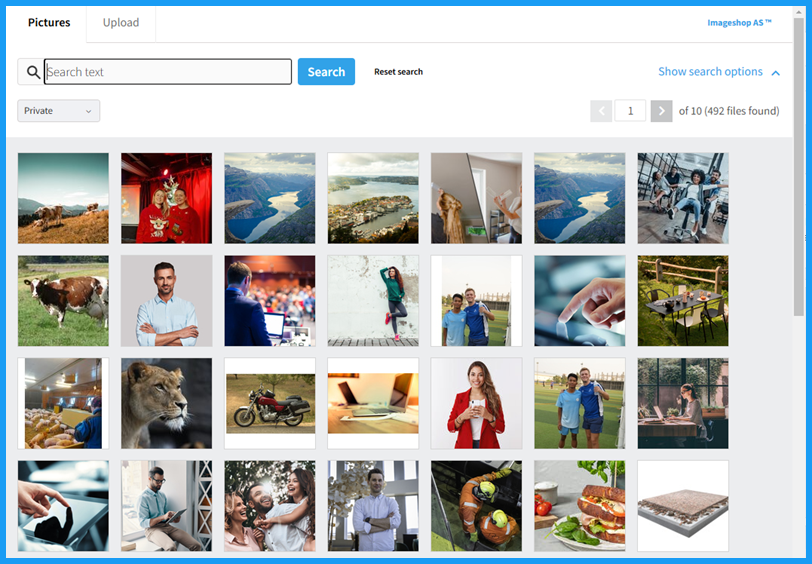

# Sanity Asset Source Plugin: ImageShop

Imageshop is a complete Digital Asset Management system (DAM system) for organizing and sharing images, videos and documents. This plugin integrates Imageshop image picker neatly into Sanity, so that you can access all your company's images inside Sanity CMS with only one click. You can also upload photos to Imageshop without leaving Sanity.

> This is a **Sanity Studio v3** plugin. If you are still on sanity V2, [see the V2 plugin here](https://github.com/Keyteq/sanity-plugin-asset-source-imageshop)




## Installation

```sh
npm install @screentek/sanity-plugin-asset-source-imageshop
```

## Usage

Add it as a plugin in `sanity.config.ts` (or .js):

```ts
import {defineConfig} from 'sanity'
import {imageShopAsset} from '@screentek/sanity-plugin-asset-source-imageshop'

export default defineConfig({
  //...
  plugins: [
    imageShopAsset({
      IMAGESHOPTOKEN: "<YOUR IMAGESHOP TOKEN>"
    })
  ],
})
```


## Configuration


There are many ways to configure the interface for image selection.


| Configuration key | Description |   Type         |   Default value   |
| ------------- | ------------- | ---------------- | ----------------- |
| **IMAGESHOPTOKEN**  | Required. Token to communicate with imageshop.  | string |  |
| IMAGE_MAX_SIZE  | Max size of the image returned from imageshop to sanity. Format: WxH |  string  |  2048x2048 |
| IMAGE_ALIAS  | Imageshop alias for permalink of image |  string  |  "Large" |
| IMAGESHOPINTERFACENAME  |  Standard interface used when searching images.  | string |  |
| IMAGESHOPDOCUMENTPREFIX  | Standrad document code prefix used when uploading images. |  string  |  |
| CULTURE  | Language for the client. Supports en-US and nb-NO. Norwegian is default (nb-NO) |  string  | "nb-NO" |
| PROFILEID  | 	Name of a profile, which has to be created by Screentek, which will return several different sizes and aspect ratios. IMAGESHOPSIZE can not be used together with a profile, and showing size dialogue or crop dialogue doens't make sence when using profiles. |  string  |  |
| REQUIREDUPLOADFIELDS  | String indicating upload fields which are required, separated by komma. Possible values: name, description, rights, credits, tags |  string  |  |
| UPLOADFIELDLANGUAGES  | List of languages which should be shown for name, description etc. Default = no,en. |  string  |  |
| SANITY_ASSET_TEXT_LANGUAGE | What language to store in sanity, from the title, description and credit fields | string | "no" |
| IMAGE_FIELDS_MAPPING | A mapping of IMAGE_SHOP_FIELD_NAME: SANITY_FIELD_NAME. Example: `{"description": "altText", "credits": "credits"}`. Fields will be imported on the image object as extra fields. Useful for e.g. altText. | object:{ string: string } | {} |


## Enable multi batch upload

If you have an array of type `image`, you can enable multi batch upload like this with the `options.batchUpload` set to `true`.

If batchUpload is enabled, another button will appear, which allows you to select multiple images and add them to the array.

```
const imagesField = {
  name: 'images',
  title: 'Images',
  type: 'array',
  options: {
    batchUpload: true
  },
  of: [
    {
      name: 'image',
      type: 'image',
      title: 'Image',
      options: {
        hotspot: true
      },
      validation: Rule => [Rule.required().error('Image is required')],
    }
  ]
}

```


## Enable multi language text selection

If your sanity have multiple language you need to implement a language resolver, we need to know where to get the texts from in imageshop.


```js
imageShopAsset({
  languageResolver: () => {
    // This really depdends on how you have implemented some kind of language context in sanity, where user
    // can switch language based on a select menu.

    // Here you can get the current language in .e.g localstorage in your sanity client. 
    // Then you return a valid imageshop language based on this.
    // example:
    const currentLanguage = "nb";  // get from localstorage ?

    if (currentLanguage == "nb) return "no";

    // Default return some language that is valid.
    return "no";
  }
})

```

## Custom fields for multiuploaded images

If you want to assign custom `fields` on the image object, you can create a custom field-mapper, which you can get texts from imageshop and then transfer the texts to the sanity image objects fields.


```js
imageShopAsset({
  // Should return the asset after its transformed.
  fieldMapper: (asset, texts) => {
    // texts = data from imageshop. 
    // asset = the sanity image object.
    // Do custom mapping of fields here. Example:
    console.log({ asset, texts })

    asset.altText = texts.no.title
    asset.credits = texts.no.credits

    return asset
  }
});

```


## License

[MIT](LICENSE) © ImageShop AS

## Develop & test


```
# in this project
npm run link-watch

# in another sanity installation
npx yalc add @screentek/sanity-plugin-asset-source-imageshop && npx yalc link @screentek/sanity-plugin-asset-source-imageshop && npm install
```

This plugin uses [@sanity/plugin-kit](https://github.com/sanity-io/plugin-kit)
with default configuration for build & watch scripts.

See [Testing a plugin in Sanity Studio](https://github.com/sanity-io/plugin-kit#testing-a-plugin-in-sanity-studio)
on how to run this plugin with hotreload in the studio.
